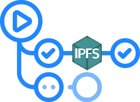

# ipfs-action
IPFS upload GitHub Action. It allows uploading DApps or content to IPFS in a GitHub pipeline.

<p align="center">
  
</p>

## Inputs
Parameter       |Required |Description
---             |---      |---
`path`          |Yes      |Directory's path to upload.
`service`       |No       |Type of target service to upload. Supported services [`ipfs`, `pinata`, `infura`, `filebase`]. Default `ipfs`
`timeout`       |No       |Request timeout. Default `60000` (1 minute)
`verbose`       |No       |Level of verbosity [`false` - quiet, `true` - verbose]. Default `false`
`host`          |No       |[ipfs] IPFS host. Default `ipfs.komputing.org`
`port`          |No       |[ipfs] IPFS host's port. Default `443`
`protocol`      |No       |[ipfs] IPFS host's protocol. Default `https`
`headers`       |No       |[ipfs] IPFS headers as json object. Default `{}`
`key`           |No       |[ipfs] IPNS key name. IPNS key will be published when the key parameter is provided. The key will be created if it does not exist. Default `undefined`
`pinName`       |No       |[psa] Human name for pin.
`pinataKey`     |No       |[pinata] Api Key. Required for pinata service.
`pinataSecret`  |No       |[pinata] Secret Api Key. Required for pinata service.
`pinataPinName` |No       |[pinata] Human name for pin.
`filebaseBucket`|No       |[filebase] Bucket to store pin in. Required for filebase service.
`filebaseKey`   |No       |[filebase] S3 Access Key. Required for filebase service.
`filebaseSecret`|No       |[filebase] S3 Secret Key. Required for filebase service.
`infuraProjectId`     |No       |[infura] Project ID. Required for infura service.
`infuraProjectSecret` |No       |[infura] Project Secret. Required for infura service.
## Outputs

- `hash` - IPFS CID
- `cid` - IPFS CID
- `ipfs` - IPFS CID
- `ipns` - IPNS CID if applicable

## Documentation
Take a look [DApps Delivery Guide](https://dapps-delivery-guide.readthedocs.io/)

## Examples

<!-- 
### IPFS starter
```
uses: aquiladev/ipfs-action@master
with:
  path: ./
```

### IPFS with output and params
```
uses: aquiladev/ipfs-action@master
id: ipfs
with:
  path: ./build
  host: ipfs.io
  port: 5001
  protocol: https
  timeout: 180000
  verbose: true
```
-->

### Pinata starter
```
uses: aquiladev/ipfs-action@master
with:
  path: ./build
  service: pinata
  pinataKey: ${{ secrets.PINATA_KEY }}
  pinataSecret: ${{ secrets.PINATA_SECRET }}
```

### Infure starter
```
uses: aquiladev/ipfs-action@master
with:
  path: ./build
  service: infura
  infuraProjectId: ${{ secrets.INFURA_PROJECT_ID }}
  infuraProjectSecret: ${{ secrets.INFURA_PROJECT_SECRET }}
```

### Filebase starter
```
uses: aquiladev/ipfs-action@v1
with:
  path: ./build
  service: filebase
  pinName: 'ipfs-action'
  filebaseBucket: ${{ secrets.FILEBASE_BUCKET }}
  filebaseKey: ${{ secrets.FILEBASE_KEY }}
  filebaseSecret: ${{ secrets.FILEBASE_SECRET }}
```
